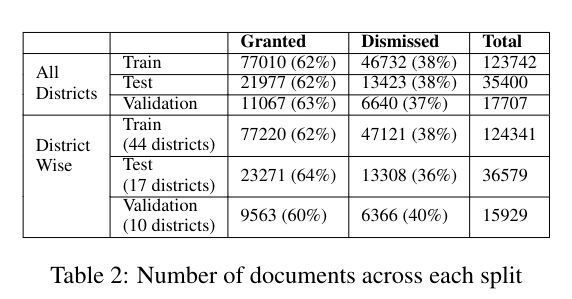

## HLDC Data Stats



## Running Order
1. [OCR](./ocr.py)
2. [NER_and_document_division.ipynb](./NER_and_Document_division.ipynb)
3. [bail_decision_and_amount_extraction](./bail_decision_and_amount_extraction.ipynb)
4. [RemovingJudgeOpinion](./RemovingJudgeOpinion.ipynb)
5. [train_test_split_code](./train_test_split_code.ipynb)

## Brief Overview
### OCR
- Uses tesseract to convert raw PDFs downloaded in the data collection step to txt files. 
- Uses intermediatary Ghostscript to convert pdf to tiff files.
- ``` python3 ocr.py - Also Update the file paths in the code to reflect the folder with raw pdfs and where you wish to save the results.``` 

### NER_and_Document_division
- Removes Invalid Documents.
- Divides valid OCRed bail documents into `header`, `body` and `result` sections.
- Does NER removal on all Document.
- ``` python3 NER_and_document_division.py - Update the file paths in the code to reflect the folder with processed text from OCR and where you wish to save the results``` 

### bail_decision_and_amount_extraction
- Extracts bail decision and amount from the documents.
- ``` python3 bail_decision_and_amount_extraction.py - Update the file paths in the code to reflect the folder with divided text from document and where you wish to save the results``` 

### RemovingJudgeOpinion
- Divides body into `facts-and-arguments` and `judge-opinion` sections.
- ``` python3 RemovingJudgeOpinion.py - Update the file paths in the code to reflect the folder bail decision extracted and output directory ```
### train_test_split_code
- getting the train-test split. 
- ``` python3 train_test_split_code.py - Update the file paths in the code to reflect the folder after judge's opinion has been removed and target folder for train test - for convenience the data after the train test was split has also been made public ```
